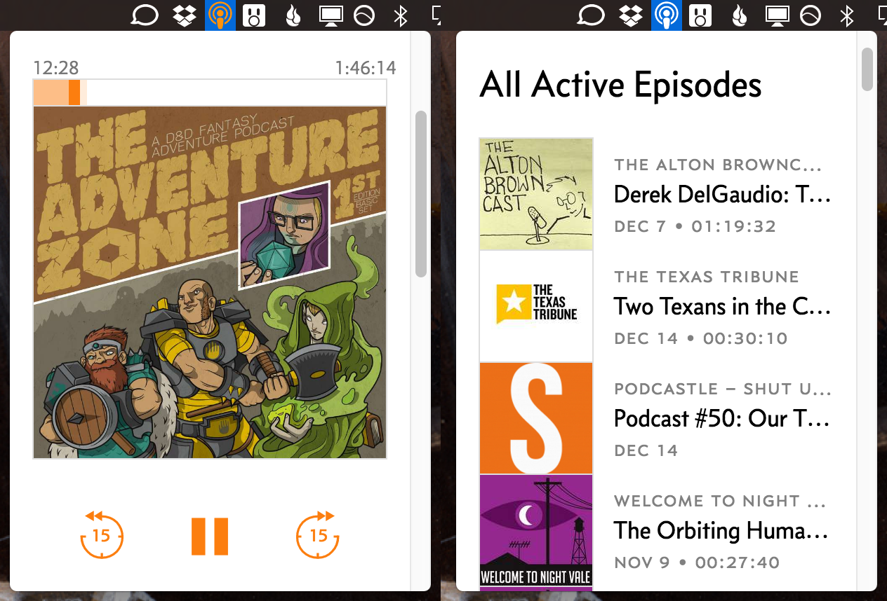

# Undercast - A Mac & Windows Desktop App for Overcast with Media Key Support

Undercast is a small third-party desktop applet for [Marco Arment's](https://marco.org/) popular iOS podcatching app [Overcast](https://overcast.fm/).

# What's Undercast For?

Overcast has become a popular alternative to Apple's first-party Podcasts app. It's simple and clean interface makes it easy to access your shows, and it has a few nice power features like voice boost and smart speed. Overcast also has a syncing service to manage your subscriptions and playback progression across devices, but it unfortunately lacks an official Mac or Windows client. Overcast *does* sync your data with [Overcast.fm](https://overcast.fm/) however. [Overcast.fm](https://overcast.fm/) lets you access your subscriptions, and offers a basic web-based player for listening to your shows.

On it's own, [Overcast.fm](https://overcast.fm/) is a good solution for accessing your podcasts on the desktop when in a pinch. It lives in one of your browser tabs however, so there's a chance you can accidentally close it, and more critically, it lacks support for the ubiquitous keyboard media keys.

Undercast tries to make up for these shortcomings. Rather than writing an entirely new podcasting client that highjacks Overcast's syncing service, Undercast simply wraps the [Overcast.fm](https://overcast.fm/) web player inside of a desktop applet that lives in your menubar or system tray.

# Features

* Undercast lives in your menubar or system tray.
	* Click on it to pull up the Overcast window, or right click on it to access the options or quit.
* Media Key Support. Undercast supports keyboard media keys on both Mac and Windows.
	* Play keys will play and pause your podcast. Stop keys will pause the currently playing podcast. Forward/Rewind keys will jump your podcast forward or back by a few seconds.
	* The amount of seconds Undercast skips is determined by a setting on the iOS app. In Overcast, tap on the Overcast icon on the top left of the main screen, then go into the "Nitpicky Details" menu, then change "Seek Back By" and "Seek Forward By" to your desired values.
	* By default, Undercast will attempt to bind your system's global media keys to it. If you would like to free up control of your system's media keys to another application, right click on the icon and deselect "Bind Media Keys".
* Playback Indicator
	* By default, Undercast's icon changes from white to orange when a podcast is playing. This setting can be disabled in the right click menu.

# How Undercast Works

Undercast uses a technology called [Electron](http://electron.atom.io). It was developed by Github for use with their [Atom](http://atom.io) text editor, but has become a generalized tool for creating cross platform applications using web technologies like HTML, CSS, and Javascript.

Using Electron, Undercast creates a sandboxed instance of [Overcast.fm](https://overcast.fm/)'s website. As far as the website is concerned, it's just been opened in a standard browser instance. Undercast then injects a small javascript API into the Overcast instance to enable media key controls. The menubar aspects of Electron are handled by [maxogden](https://github.com/maxogden)'s [menubar](https://github.com/maxogden/menubar) package.

# Getting Undercast

Precompiled builds of Undercast are located in the `/releases` folder. Simply unzip them and launch the .app or .exe file.

[Current Mac Release](https://github.com/ImStuartJones/undercast/raw/master/releases/Undercast.app.zip)

[Current Windows Release](https://github.com/ImStuartJones/undercast/raw/master/releases/undercast-win32-x64.zip)

# Building It Yourself

Undercast is a standard straightforward Electron application. Run `npm install` to download the necessary Node packages, then run `./node_modules/.bin/electron .` to launch the application. Compiling the application for production can be done with the `electron-packager . Undercast --ignore=\releases` npm module.

# Disclaimer

Undercast is not an official Overcast application. It has no relation to Marco Arment, and offers no guarantee that it will continue working in the future. Undercast is a free open source project available under the MIT license.
